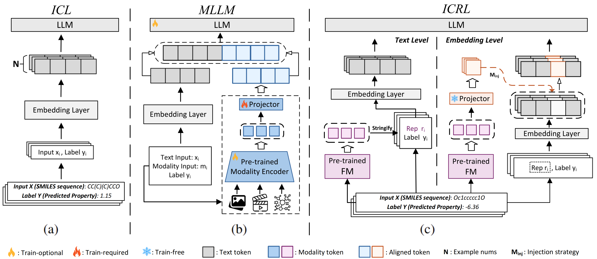

# 🚀 In-Context Representation Learning (ICRL)

This repository contains the implementation of the following paper. 

<!-- 📄 **Can LLMs Reason Over Non-Text Modalities in a Training-Free Manner?A Case Study with In-Context Representation Learning**   -->


> **Can LLMs Reason Over Non-Text Modalities in a Training-Free Manner?A Case Study with In-Context Representation Learning**<br>
> Authors: Tianle Zhang, Wanlong Fang, Jonathan Woo, Paridhi Latawa, Deepak A. Subramanian, Alvin Chan  
> The Thirty-ninth Annual Conference on Neural Information Processing Systems (**NeurIPS**), 2025

<!-- > [Ziqi Huang](https://ziqihuangg.github.io/)<sup>∗</sup>, [Yinan He](https://github.com/yinanhe)<sup>∗</sup>, [Jiashuo Yu](https://scholar.google.com/citations?user=iH0Aq0YAAAAJ&hl=zh-CN)<sup>∗</sup>, [Fan Zhang](https://github.com/zhangfan-p)<sup>∗</sup>, [Chenyang Si](https://chenyangsi.top/), [Yuming Jiang](https://yumingj.github.io/), [Yuanhan Zhang](https://zhangyuanhan-ai.github.io/),  [Tianxing Wu](https://tianxingwu.github.io/), [Qingyang Jin](https://github.com/Vchitect/VBench), [Nattapol Chanpaisit](https://nattapolchan.github.io/me), [Yaohui Wang](https://wyhsirius.github.io/), [Xinyuan Chen](https://scholar.google.com/citations?user=3fWSC8YAAAAJ), [Limin Wang](https://wanglimin.github.io), [Dahua Lin](http://dahua.site/)<sup>+</sup>, [Yu Qiao](http://mmlab.siat.ac.cn/yuqiao/index.html)<sup>+</sup>, [Ziwei Liu](https://liuziwei7.github.io/)<sup>+</sup><br> -->
<!-- 
👨‍💻 **Authors:**  
Tianle Zhang, Wanlong Fang, Jonathan Woo, Paridhi Latawa, Deepak A. Subramanian, Alvin Chan   -->

🔗 **Links:**  
- [📑 Paper (arXiv)](https://arxiv.org/abs/xxxx.xxxxx)  


---

## 📣  Overview



We introduce **In-Context Representation Learning (ICRL)**, a training-free framework that enables Large Language Models (LLMs) to directly consume and reason over **representations from non-text foundation models (FMs)**. Unlike standard in-context learning (ICL), which relies on text–label pairs, ICRL injects modality-specific embeddings into LLMs either at the **text level** (via dimensionality-reduced PCA strings) or at the **embedding level** (via zero-padding, random projection, or optimal transport alignment). This design allows LLMs to perform multimodal inference **without additional fine-tuning or paired data**, offering a lightweight and highly adaptable alternative to supervised alignment.

Through extensive studies across molecular property prediction and beyond, we show that ICRL exhibits several important properties:

* **Generic Integration**: Works with diverse modality encoders (e.g., molecular, protein, vision, audio) by aligning their embeddings into the LLM’s representational space.
* **Representation-Level Generalization**: Preserves the geometry of FM embeddings and adapts LLMs to new modalities purely through few-shot examples in context.
* **Training-Free Efficiency**: Provides a lightweight alternative that can be executed within seconds on CPU, offering a favorable efficiency–performance balance compared to resource-intensive fine-tuning pipelines for multimodal LLMs.
* **In-Depth Analysis**: Beyond empirical benchmarks, we conduct systematic studies on injection strategies, projector designs, and representation alignment. These analyses reveal the underlying mechanisms that govern ICRL’s performance, shedding light on when and why representation-level integration succeeds, and guiding future extensions across domains.


ICRL demonstrates the **universality and practicality of representation-level approaches**: instead of training new multi-modal architectures, existing FMs and LLMs can be seamlessly composed at inference time. This opens a promising direction for **scalable, plug-and-play multimodal reasoning** across scientific and real-world domains.

---

## 📦 Environment Setup

We recommend using **conda** to manage the environment.

```bash
conda create -n llmxfm python=3.10 -y
conda activate llmxfm
pip install -r requirements.txt
```

Alternatively, install from the provided environment file:

```bash
conda env create -f environment.yml
conda activate llmxfm
```

---

## 📂 Dataset & FM Cache Download

We provide most datasets and pre-computed FM (foundation model) caches on Hugging Face:

➡️ [**tianle233/icrl-data**](https://huggingface.co/datasets/tianle233/icrl-data)

After downloading:

* Place the `data/` folder under `LLMxFM/data/` (at the same level as `chemistry/`).
* Place the `datasets/` folder under `LLMxFM/chemistry/datasets/`.

### Folder Structure

```
LLMxFM/
├── chemistry/
│   ├── SC_scripts/
│   ├── datasets/   # Pre-computed FM caches (significantly reduce inference cost)
│   └── ...
├── data/           # Raw datasets for experiments
└── ...
```

### Why FM caches?

* The `datasets/` folder contains cached FM representations for all modalities used in our experiments.
* Using these caches **saves significant computation time** and enables fast reproduction of the reported results.
* If desired, you can regenerate caches yourself using the `get_cache` utilities, but we recommend starting from the provided Hugging Face release.

---


## 🔬 Experiments Overview

This repository provides code and scripts to reproduce all experiments in our NeurIPS paper.

* **Location**: The majority of experiments are under `chemistry/SC_scripts/`.
* **Structure**:

  * `{task_type}_trainer_{ICRL_type}.py` → core implementation of each experiment.
  * `{task_type}_run_trainer_{ICRL_type}.py` → entry point for running each experiment.
* **Subfolders**:

  * `MOL_exp` / `ESM_exp`: Small molecule and protein modality experiments.
  * `MOL_contrastive_learning_caption_ft`: Contrastive learning + caption generation for molecules (adapted from [Vector-ICL](https://github.com/EvanZhuang/vector-icl)).
  * `ESM_contrastive_learning_caption_ft`: Protein contrastive learning + caption generation.
  * `DTI_exp`, `Caption_QA`, `AUDIO_ICRL`: Drug–target interaction, SMILES captioning/QA, and audio modality experiments.
  * `get_cache`: Utilities for extracting and storing FM representations to avoid redundant inference cost. You may either generate the cache yourself or directly use the pre-computed cache.

**How to run**:

1. Copy the relevant `trainer` and `run_trainer` files from a subfolder into `chemistry/SC_scripts/`.
2. Use the provided shell (`.sh`) or cluster job (`.pbs`) scripts as references, or execute the commands directly.

---

### ⚙️ Key Parameters

* **`experiment_type`**

  * For `pca_icl_baseline`: options = `pca_icl`, `icl`, `pca`.
  * For other ICRL variants: options = `rep_icl`, `rep`, `rep_icl_w_o_norm`, `rep_w_o_norm`.

    * *With normalization*: typically better performance.
    * *Without normalization*: may better preserve FM-specific signals or avoid invalid input values.

* **`model_name`**

  * Supported LLM backbones: **LLaMA series** (`meta-llama/Llama-3.1-8B-Instruct`, `meta-llama/Llama-3.1-70B-Instruct`).
  * Other LLMs can be used with minor adjustments.

* **`num_tests`**

  * Maximum number of test samples.
  * Defaults to 1000 for large datasets (due to inference cost); full set used if smaller.

* **`n_representation_shots`**

  * Number of in-context examples (shots).
  * Default = 20; higher values usually improve performance.

* **`experiment_name`**

  * Custom tag for grouping results. Final log names are generated from `experiment_name`, `experiment_type`, and hyperparameters.

* **`seed`**

  * Random seed for reproducibility.
  * Since ICL is unstable, we run 10 seeds and report the top-3 results, summarized using `get_top_k.py` or `get_top_rmse.py`.

* **`task_name`**

  * Dataset name for the experiment (varies by modality).

* **ICRL type naming**

  * `pca_icl_baseline`: PCA + ICL baseline.
  * `embed_OT_icl`: OT-Embed.
  * `hash`: RandomNoise.
  * `pca_OT_icl`: OT-PCA.
  * `icrl`: RandomProjection.
  * *Zero-Pad is not provided separately but can be derived from any trainer file.*

---

## 🧪 Example: Molecular Property Prediction

Below is an example shell script (`chemistry/SC_scripts/MOL_exp/submit_MOL2.sh`) to reproduce results on **Lipophilicity (AstraZeneca)** with **LLaMA-3.1-8B-Instruct**.

```bash
export HF_HOME=/mnt/hdd1/cache
cd /mnt/ssd/ztl/LLMxFM
conda activate llmxfm

SEEDS=("2021" "7777" "8888" "1111" "2222" "3333" "5555" "101010" "202020" "606060")
SHOTS=(20)

TASK_NAME="Lipophilicity_AstraZeneca"
MODEL_NAME="meta-llama/Llama-3.1-8B-Instruct"

for SHOT in "${SHOTS[@]}"; do
    echo "Running for shot: $SHOT"
    for SEED in "${SEEDS[@]}"; do
        echo "Running for seed: $SEED"

        CUDA_VISIBLE_DEVICES=3 python -m chemistry.SC_scripts.MOL_run_trainer_pca_OT_icl \
            --experiment_type rep \
            --model_name $MODEL_NAME \
            --num_tests 1000 \
            --n_representation_shots $SHOT \
            --experiment_name pca_ot \
            --seed $SEED \
            --task_name $TASK_NAME

        CUDA_VISIBLE_DEVICES=3 python -m chemistry.SC_scripts.MOL_run_trainer_pca_OT_icl \
            --experiment_type rep_w_o_norm \
            --model_name $MODEL_NAME \
            --num_tests 1000 \
            --n_representation_shots $SHOT \
            --experiment_name pca_ot \
            --seed $SEED \
            --task_name $TASK_NAME

        CUDA_VISIBLE_DEVICES=3 python -m chemistry.SC_scripts.MOL_run_trainer_pca_OT_icl \
            --experiment_type rep_icl \
            --model_name $MODEL_NAME \
            --num_tests 1000 \
            --n_representation_shots $SHOT \
            --experiment_name pca_ot \
            --seed $SEED \
            --task_name $TASK_NAME
    done
done
```

This script runs all variants (`rep`, `rep_w_o_norm`, `rep_icl`) across 10 random seeds with 20-shot examples. Logs and outputs are stored under `/chemistry/logs/`.

---


### :warning: Known Issues :warning:
> ***Disclaimer :grey_exclamation:***  
>
> While In-Context Learning (ICL) inevitably involves some variance due to hardware differences and random seed selection, our experiments demonstrate that these effects **do not alter the main conclusions**.
>
> We have fixed random seeds wherever possible, and on a single machine our results are fully reproducible. On large-scale clusters, occasional variation may occur—even with the same FM cache and identical codebase—but repeated trials consistently yield the same trends and support our claims.
>
> Importantly, such behavior is not unique to our method and is also observed in baseline ICL approaches. To promote transparency, we release a recent subset of our experiment logs on [Hugging Face](https://huggingface.co/datasets/tianle233/icrl-data/)(note: earlier logs were automatically cleared by the cluster).


---

# 📖 BibTex
```bibtex
@inproceedings{
    charakorn2025texttolora,
    title={Text-to-Lo{RA}: Instant Transformer Adaption},
    author={Rujikorn Charakorn and Edoardo Cetin and Yujin Tang and Robert Tjarko Lange},
    booktitle={Forty-second International Conference on Machine Learning},
    year={2025},
    url={https://openreview.net/forum?id=zWskCdu3QA}
}
```
